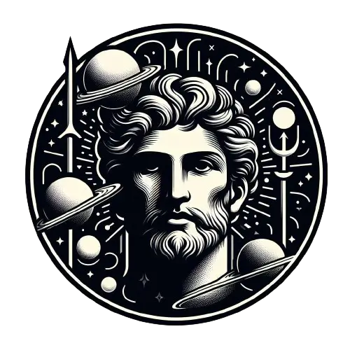

  
  <h1>Mercury Editor</h1>

  

Mercury editor is a simple and easy to use text editor. It has a clean and intuitive interface, and it is also very light.

## 💻 Tech Stack

1.  ReactJS
2.  TypeScript
3.  TailwindCSS
4.  Tauri
5.  Vite
